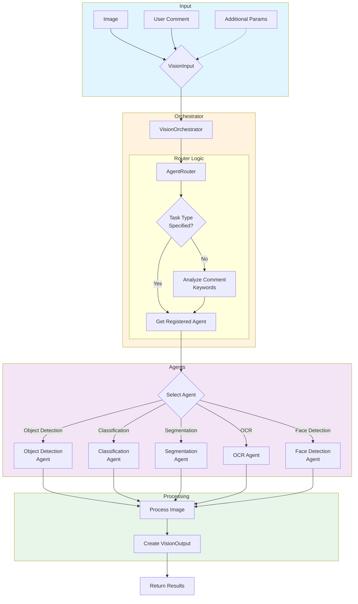

# Vision Framework: Multi-Agent System for Computer Vision Tasks

<div align="center">

[](https://github.com/ntkhoa95/multi-agent-for-vision/actions/workflows/ci.yml)
[](https://codecov.io/gh/ntkhoa95/multi-agent-for-vision)
<div align="center">

[](https://github.com/ntkhoa95/multi-agent-for-vision/actions/workflows/ci.yml)
[](https://codecov.io/gh/ntkhoa95/multi-agent-for-vision)
[](https://github.com/psf/black)
[](https://opensource.org/licenses/MIT)


A flexible and extensible multi-agent framework for computer vision tasks, supporting classification, object detection, and more.

<details>
<summary>📋 Table of Contents</summary>

- [Features](#-features)
- [Quick Start](#-quick-start)
- [Available Examples](#-available-examples)
- [Basic Usage](#-basic-usage)
- [Architecture](#-architecture)
- [Configuration](#-configuration)
- [Supported Tasks](#-supported-tasks)
- [Development](#-development)
- [Contributing](#-contributing)
- [License](#-license)
- [Acknowledgments](#-acknowledgments)
- [Contact](#-contact)

</details>

## ✨ Features

<table>
<tr>
<td>

### 🤖 Multi-Agent Architecture
- Classification Agent (MobileNetV3)
- Object Detection Agent (YOLOv8)
- Easily extensible for new vision tasks

### 🗣️ Natural Language Interface
- "What's in this image?"
- "Detect objects in this scene"
- "Classify this image"
### 🗣️ Natural Language Interface
- "What's in this image?"
- "Detect objects in this scene"
- "Classify this image"

</td>
<td>

### 🎯 Intelligent Task Routing
- Automatic agent selection
- Query-based task determination
- Flexible routing system

### 📊 Comprehensive Output
- Detailed predictions with confidence scores
- Processing time metrics
- Model configuration details
</td>
<td>

### 🎯 Intelligent Task Routing
- Automatic agent selection
- Query-based task determination
- Flexible routing system

### 📊 Comprehensive Output
- Detailed predictions with confidence scores
- Processing time metrics
- Model configuration details

</td>
</tr>
</table>

</td>
</tr>
</table>

## 🚀 Quick Start

<details>
<summary>Installation Steps</summary>
<details>
<summary>Installation Steps</summary>

```bash
# Clone the repository
git clone https://github.com/ntkhoa95/multi-agent-for-vision.git
cd multi-agent-for-vision

# Install dependencies
pip install -r requirements.txt
python -m spacy download en_core_web_sm

# Install in development mode
pip install -e .
```
</details>

## 🎯 Demo Application

The Vision Framework includes a user-friendly web interface built with Gradio:

```bash
# Run the demo application
python examples/gradio_demo.py
```

<div align="center">

</div>

- Interactive web interface
- Real-time inference
- Support for both classification and detection
- Natural language query processing
- Visual results with bounding boxes and labels
</details>

## 🎯 Demo Application

The Vision Framework includes a user-friendly web interface built with Gradio:

```bash
# Run the demo application
python examples/gradio_demo.py
```

<div align="center">

</div>

- Interactive web interface
- Real-time inference
- Support for both classification and detection
- Natural language query processing
- Visual results with bounding boxes and labels

## 🗂️ Available Examples

<details>
<summary>1. Classification Example (classification_example.py)</summary>

```python
# Run the classification example
python examples/classification_example.py
```

### Features:
- Image classification with detailed class predictions
- Confidence scores for top-5 predictions
- Model configuration display
- Processing time metrics

### Example Output:
```
Processing image: tests/data/images/dog.jpg
Query: What is in this image?
Task Type: VisionTaskType.IMAGE_CLASSIFICATION
Classification Results:
  Golden retriever: 0.856
  Labrador retriever: 0.125
  Irish setter: 0.012
  Chesapeake Bay retriever: 0.004
  Greater Swiss Mountain dog: 0.003

Model Configuration:
  Model: mobilenetv3_large_100
  Input size: (3, 224, 224)
  Interpolation: bicubic
  Mean: (0.485, 0.456, 0.406)
  Std: (0.229, 0.224, 0.225)
Processing time: 0.064 seconds
```
</details>
</details>

<details>
<summary>2. Object Detection Example (detection_example.py)</summary>

```python
# Run the detection example
python examples/detection_example.py
```

### Features:
- Multiple object detection
- Bounding box coordinates
- Class predictions with confidence scores
- Processing time metrics
</details>

<details>
<summary>3. Video Processing Example (video_processing_example.py)</summary>

```python
# Run the video processing example
python examples/video_processing_example.py
```
</details>

## 💻 Basic Usage

```python
from vision_framework import VisionOrchestrator
from vision_framework.core.types import VisionTaskType

# Initialize the framework
config = {
    'DEVICE': 'cuda',  # or 'cpu'
    'MODEL_NAME': 'mobilenetv3_large_100',
    'MODEL_PRETRAINED': True
}
orchestrator = VisionOrchestrator(config)

# Process an image
result = orchestrator.process_image(
    image_path="path/to/image.jpg",
    user_comment="What is in this image?"
)

# Print results
print(f"Task Type: {result.task_type}")
print(f"Confidence: {result.confidence}")
print("Predictions:", result.results)
```

## 🏗️ Architecture

<details>
<summary>Project Structure</summary>

```
vision_framework/
├── setup.py                # Package setup and dependencies
├── requirements.txt        # Project dependencies
├── README.md              # Project documentation
├── LICENSE                # License file
├── .gitignore            # Git ignore file
├── README.md              # Project documentation
├── LICENSE                # License file
├── .gitignore            # Git ignore file
│
├── vision_framework/      # Main package directory
│   ├── __init__.py        # Package initialization
│   ├── config.py          # Configuration management
│   ├── orchestrator.py    # Vision Orchestrator management
├── vision_framework/      # Main package directory
│   ├── __init__.py        # Package initialization
│   ├── config.py          # Configuration management
│   ├── orchestrator.py    # Vision Orchestrator management
│   │
│   ├── core/              # Core functionality
│   ├── agents/            # Vision agents
│   ├── nlp/               # NLP processing
│   ├── router/            # Request routing
│   └── utils/             # Utility functions
│
├── tests/                 # Test directory
│   ├── unit/              # Unit tests
│   ├── integration/       # Integration tests
│   └── data/              # Test data
│
└── examples/             # Example scripts
```
</details>

### Framework Workflow



### Core Components

1. **Vision Orchestrator**: Central component managing the interaction between agents
2. **Agents**: Specialized modules for specific vision tasks
3. **Router**: Determines appropriate agent based on user queries
4. **NLP Processor**: Interprets natural language queries

## ⚙️ Configuration

<details>
<summary>Configuration Options</summary>

```python
config = {
    'DEVICE': 'cuda',                    # Device for inference
    'MODEL_NAME': 'mobilenetv3_large_100', # Classification model
    'MODEL_PRETRAINED': True,            # Use pretrained weights
    'BATCH_SIZE': 1,                     # Batch size for inference
    'NUM_WORKERS': 0,                    # Workers for data loading
    'YOLO_MODEL_NAME': 'yolov8s.pt',     # Detection model
    'YOLO_CONFIDENCE_THRESHOLD': 0.25,    # Detection confidence
    'YOLO_IOU_THRESHOLD': 0.45,          # Detection IOU threshold
}
```
</details>

## 📊 Supported Tasks

### 1. Image Classification
- Identifies main subjects in images
- Returns top-5 predictions with confidence scores
- Supports ImageNet classes

### 2. Object Detection
- Locates and identifies multiple objects
- Provides bounding boxes and confidence scores
- Supports COCO classes

## 🛠️ Development

<details>
<summary>Setting Up Development Environment</summary>

```bash
# Create and activate virtual environment
python -m venv .venv
source .venv/bin/activate  # On Windows, use: .venv\Scripts\activate

# Install development dependencies
pip install -e ".[dev]"

# Install pre-commit hooks
pre-commit install

# Download required NLTK data
python -c "import nltk; nltk.download('wordnet')"

# Download spaCy model
python -m spacy download en_core_web_sm

# Download required NLTK data
python -c "import nltk; nltk.download('wordnet')"

# Download spaCy model
python -m spacy download en_core_web_sm
```
</details>

### Running Tests
```bash
pytest tests/
```

## 🤝 Contributing

1. Fork the repository
2. Create a feature branch (`git checkout -b feature/AmazingFeature`)
3. Make your changes
4. Run tests (`pytest tests/`)
5. Commit your changes (`git commit -m 'Add some AmazingFeature'`)
6. Push to the branch (`git push origin feature/AmazingFeature`)
7. Open a Pull Request

## 📄 License

This project is licensed under the MIT License - see the [LICENSE](LICENSE) file for details.

## 🙏 Acknowledgments

- [timm](https://github.com/rwightman/pytorch-image-models) for efficient model implementations
- [YOLOv8](https://github.com/ultralytics/ultralytics) for object detection
- [PyTorch](https://pytorch.org/) for the deep learning framework
- [Gradio](https://gradio.app/) for the demo interface

## 📧 Contact

<div align="center">

**Khoa Nguyen**

[](mailto:toankhoabk@gmail.com)
[](https://github.com/ntkhoa95/multi-agent-for-vision)

</div>
